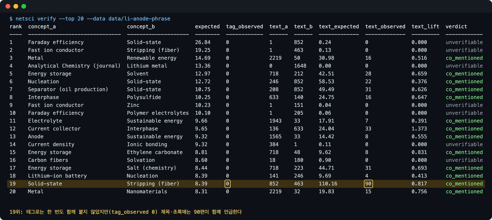
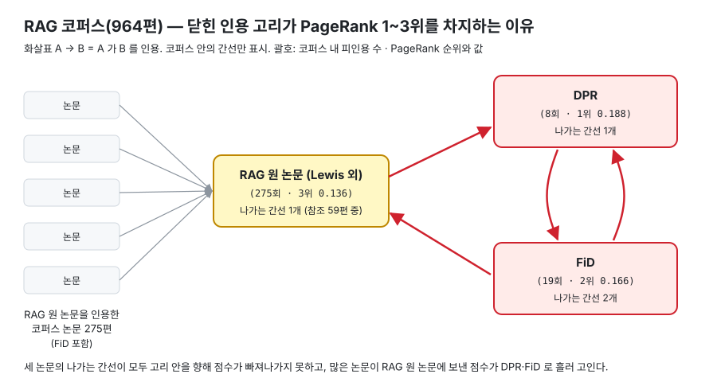

# netsci

[](https://github.com/JuuuuHong/netsci/actions/workflows/ci.yml)

> 과학 문헌에서 기대보다 함께 등장하지 않는 개념 조합을 네트워크 구조로 찾고, 그 결과가 진짜인지 원자료로 확인한다.

[OpenAlex](https://openalex.org) 논문 메타데이터로 **인용 네트워크**와 **개념 동시출현 네트워크**를 만들고,
"각자는 자주 등장하는데 기대보다 함께 등장하지 않는 개념 쌍"을 찾는 Rust CLI 입니다.
"함께 연구되지 않았다"를 판정하지는 않습니다. 판단 기준은 아래 `gaps` 설명에 있습니다.

이 접근은 문헌 기반 발견(literature-based discovery)의 Swanson ABC 모델과 가깝습니다.
ABC 모델은 A–B 와 B–C 는 각각 다뤄졌는데 A–C 는 함께 다뤄지지 않은 조합에서, 매개 개념 B 를 거쳐 A–C 관계의 가설을 세웁니다.
이 도구는 그중 **A–C 가 기대보다 함께 나오지 않는 후보**를 찾고, `gaps --bridges` 로 A·C 양쪽에 기대보다 자주 함께 붙는 매개 개념 B 후보를 붙입니다(동시출현 통계일 뿐 기전은 아닙니다).
`backtest` 는 과거 연도 논문으로 뽑은 후보가 이후 논문에서 함께 태깅됐는지 셉니다.
`evaluate` 는 같은 분할을 링크 예측 문제로 놓고, lift 가 다른 점수들보다 잘 맞히는지 AUROC 로 비교합니다.

- tokio 기반 순차 수집 (레이트리밋·재시도·페이지 단위 디스크 캐시, 끊겨도 이어받기, 일일 과금 한도 감시)
- PageRank 직접 구현, 동시출현 기대값 대비 lift 로 공백 후보 점수화, 제목·초록 텍스트로 후보 검증, 연도 분할 검증
- 출력 행 타입에 `#[derive(Report)]` 프로시저 매크로를 붙여 표·JSON·CSV 를 한 번에 지원
- 멀티스테이지 Docker 이미지 (비루트 실행)
- `evaluate` 로 lift 를 이웃 기반 점수·무작위와 같은 자(AUROC·precision@k)에 올려 비교

## Summary (English)

A Rust CLI that builds **citation** and **concept co-occurrence** networks from [OpenAlex](https://openalex.org)
metadata and surfaces concept pairs that are individually frequent but **co-occur less than chance** — the A–C
candidates of Swanson's ABC model of literature-based discovery.

It does **not** claim such a pair is an unexplored research opportunity. Every headline result below is a
measurement of how far the signal is from that claim:

- The top "gaps" in a lithium corpus are an artifact of how OpenAlex assigns topics (3 slots per paper,
  near-duplicate battery topics filling them), not research gaps.
- Tag-level co-occurrence of zero overstates the signal, but is not baseless: tag lift and title/abstract
  `text_lift` correlate at ρ = 0.64, and zero-co-occurrence pairs also co-occur less than chance in text.
- The independence assumption behind `expected` is violated: a Poisson approximation predicts ~29.5
  zero-co-occurrence pairs among 3,886 lithium candidates; 321 are observed. `lift` is therefore used only as a
  ranking, never as a test statistic.
- Splitting a corpus by year shows gap candidates mostly **stay** gaps, and gives no evidence that they are the
  pairs that later get filled.

`evaluate` puts that last point on a standard footing: it treats the same temporal split as a link-prediction
problem and scores `lift` against neighbourhood baselines (common neighbours, Adamic–Adar, Jaccard), frequency
baselines (raw co-occurrence, preferential attachment) and a deterministic random floor, reporting AUROC and
precision@k at both ends of the ranking. Crucially, 0.5 is **not** the null
AUROC for this design: candidate pairs are conditioned on both labels being frequent, and both the scores and the
positive labels correlate with marginal frequency, so a marginal-preserving permutation null lands anywhere from
0.37 to 0.93. `evaluate` therefore measures that null by default and reports `excess = auroc − auroc_null`.
Even that excess is not enough to rank two scorers, because it
subtracts a *separately* estimated null from each: ordering scorers by excess sign turns out to count noise
(`random` outscores `lift` on excess in one run). `evaluate` therefore collects all seven AUROCs per permutation in
one row and reports a paired permutation test of `delta = auroc(reference) − auroc(other)`.

Read that way, the claim that survives is narrow: under the "above chance" label `lift` beats `random` 8/8,
preferential attachment 7/8 and the neighbourhood baselines 6/8 at p < 0.05 — **but is indistinguishable from the
unnormalised co-occurrence count in 5 of 8 runs.** Under the "co-tagged at least once" label nothing separates at
all, including `lift` against `random` (1/8), which says the label has no discriminative power at these base rates
(0.59–0.96) rather than anything about `lift`. Two earlier drafts of this README claimed the opposite and then an
overstated win; what changed and why is recorded in order in [`docs/decisions.md`](docs/decisions.md). Results are
in [예측력 평가](#예측력-평가--evaluate) below.

Engineering notes: three-crate workspace; a `#[derive(Report)]` procedural macro that renders any row type as a
table, JSON or CSV; the HTTP client is a trait, so **no test touches the network**; deterministic output
throughout (integer cross-products instead of float comparisons for `lift` ties); resumable page cache with
rate-limit, retry and daily-budget handling; multi-stage non-root Docker image. `cargo fmt --check`,
`cargo clippy -- -D warnings` and `cargo test` run in CI.

Every design choice not fixed by [`SPEC.md`](SPEC.md) is recorded in [`docs/decisions.md`](docs/decisions.md),
including the split years, run lists and scoring rules — **written down before the results were looked at**.

## 핵심 결과

아래 "실제 실행 결과" 에서 세 분야 코퍼스로 확인한 내용입니다.

- **리튬 topics 공백 후보 상위는 토픽 배정 방식의 산물입니다.** 상위 10쌍 중 7쌍에 나오는 `Advanced Battery Technologies Research` 2,421편 중
  2,272편은 뜻이 거의 같은 배터리 토픽 둘도 함께 달고 있어, 논문당 3개인 토픽 자리가 배터리 토픽으로 찹니다. 연구 공백도, 코퍼스 오염도 아닙니다.
- **태그 공존 0 은 과장된 신호지만 근거가 없지는 않습니다.** 리튬 concepts 후보 전체에서 태그 lift 와 제목·초록 `text_lift` 의 순위상관은 0.64 이고,
  태그 공존 0 인 쌍은 텍스트에서도 기대보다 덜 함께 나옵니다(`text_lift` 중앙값 0.63). 반면 `co_mentioned`(텍스트 공존 1편 이상)는 태그 lift 와 무관하게 96% 이상이라 판별력이 없습니다.
- **RAG 인용 PageRank 1~3위는 닫힌 인용 고리입니다.** RAG 원 논문 → DPR → FiD → {DPR, RAG 원 논문} 세 편의 나가는 간선이 모두 고리 안을 향해 전체 점수의 약 49% 가 모입니다.
  OpenAlex 메타데이터 문제도 겹칩니다: RAG 원 논문 기록의 제목이 틀렸고, 964편 중 299편(31%)은 참조 목록이 비어 있습니다.
- **분류 체계 품질은 분야마다 다릅니다.** concepts 는 리튬에서는 텍스트 검증에 쓸 만했지만, RAG 에서는 상위 10개 중 8개가 동음이의어 오분류였습니다.
- **공백 후보는 시간이 지나도 대체로 공백으로 남지만, 나중에 채워질 조합을 고른다는 근거는 없습니다.** 인용 필터 없는 리튬 코퍼스를 2022년 이하(train)·이후(test)로 나누면
  concepts 공백 후보 상위 20쌍이 test 에서 함께 태깅된 비율은 61.1%(판정 가능 18쌍 중 11쌍)로 전체 후보 94.2% 보다 낮고, train lift 구간이 높을수록 test lift 중앙값이 커집니다(0.181 → 2.616).
  판정 가능한 쌍이 있는 분할 실행 7개가 모두 같은 방향입니다.
- **점수끼리의 우열은 짝지은 순열 검정으로만 말할 수 있고, 그렇게 재면 주장이 크게 줄어듭니다.**
  이 설계에서 AUROC 의 귀무값은 0.5 가 아니라 0.37~0.93 이고(후보가 "양쪽 다 흔한 쌍" 으로 조건화돼 있어서),
  귀무를 뺀 `excess` 조차 두 점수의 *차이* 에 대한 불확실성을 담지 않습니다. 같은 순열에서 차이를 모아 p 를 내면,
  `above_chance` 기준에서 lift 는 `random` 8/8 · `preferential_attachment` 7/8 · 이웃 기반 점수 6/8 을 이기지만
  **정규화하지 않은 공존 수와는 8회 중 3회만 구분됩니다.** `co_tagged` 기준에서는 `random` 상대로도 1/8 뿐이라
  **그 기준 자체에 변별력이 없습니다**(기준선 0.59~0.96).
- **"공존 0" 은 수집 조건에 민감합니다.** 피인용 20회 초과 리튬 코퍼스의 concepts 공존 0 쌍 321쌍 중 174쌍(54.2%)은 필터 없이 받은 코퍼스에서는 공존이 있습니다.
  다만 그 쌍들의 lift 중앙값은 0.086 으로 여전히 가장 낮은 구간입니다.

## 파이프라인

```
             OpenAlex /works (cursor 페이지네이션, per-page=200)
                               │
  netsci fetch ────────────────┤  <data>/raw/page-NNNN.json  (페이지 원문 캐시)
                               ▼  <data>/query.json          (질의 기록, query·filter 불일치 시 중단)
                      <data>/works.jsonl  (한 줄에 Work 하나: 참조·분류 태그·초록)
                               │
               ┌───────────────┴────────────────┐
               ▼                                ▼
      인용 그래프 (A → B)                분류 동시출현 그래프 (--taxonomy)
      코퍼스 내부 간선만                 topics: score ≥ 0.4
                                         concepts: level ≥ 2, score ≥ 0.4
               │                                │
      PageRank (d = 0.85)               가중 연결강도 · 공백 후보 (lift)
               │                                │
   netsci stats · citations          netsci concepts · gaps (--bridges: 매개 개념 B)
                                                │  공백 후보 × 제목·초록 텍스트 공존 / × 이후 연도 공존
                                                ▼
                               netsci verify · evidence · backtest · evaluate
```

## 빠른 시작

### cargo

```sh
cargo run --release -p netsci -- fetch --query '"lithium metal anode"' --limit 2000 --data data/li-anode
cargo run --release -p netsci -- stats --data data/li-anode
cargo run --release -p netsci -- gaps  --data data/li-anode --top 20 --format csv
```

공통 옵션: `--data <DIR>` (기본 `data/default`), `--format <table|json|csv>` (기본 `table`).
`OPENALEX_API_KEY` 환경변수가 있으면 요청에 `api_key` 를 붙입니다.

| 명령 | 내용 |
|---|---|
| `fetch --query Q [--filter F] [--limit N]` | 수집해 `works.jsonl` 작성. 받은 페이지는 캐시에서 다시 읽음 |
| `stats` | 작품 수, 연도 범위, 내부 인용 간선 수와 비율, 필터 후 고유 토픽·concept 수, 초록 있는 작품 수 |
| `citations [--top N]` | 코퍼스 내부 인용 그래프 PageRank 상위 N 편 |
| `concepts [--top N] [--taxonomy T] [--min-level L] [--min-score S]` | 동시출현 가중 연결강도 상위 N 개념 |
| `gaps [--top N] [--min-works W] [--taxonomy T] [--min-level L] [--min-score S] [--bridges K]` | 공백 개념쌍. `K > 0` 이면 쌍마다 매개 개념 후보 `bridges` 열 |
| `backtest --split-year Y [--top N] [--min-works W] [--taxonomy T] [--summary]` | Y 년까지의 논문으로 뽑은 공백 후보가 이후 논문에서 함께 태깅됐는지 (`--summary` 는 집단별 요약) |
| `evaluate --split-year Y [--top N] [--min-works W] [--label L] [--null-permutations P] [--reference S] [--taxonomy T]` | 같은 분할을 링크 예측으로 보고 점수 7개를 비교. 순열 귀무값(`auroc_null`), 기준 점수와의 짝지은 검정(`delta`·`p_value`), 계층화 AUROC 를 함께 냄 |
| `verify [--top N] [--min-works W] [--taxonomy T] [--alias "개념=표현"]...` | 공백 후보 상위 N 쌍을 제목·초록 텍스트 공존과 대조 (`text_lift`, `verdict`) |
| `evidence --a A --b B [--limit N] [--taxonomy T] [--alias "개념=표현"]...` | 두 표현이 제목·초록에 함께 나오는 논문 표본 (`label` 열은 사람이 채움) |

`--taxonomy <topics|concepts>` 의 기본값은 명령마다 다릅니다: `concepts`·`gaps` 는 `topics`, `verify`·`evidence` 는 `concepts`
(토픽 이름은 구문형이라 제목·초록에서 거의 찾아지지 않습니다. 아래 "한계" 참고). `--min-level` 은 concepts 에만 적용됩니다.

### docker

```
docker build -t netsci .
docker run --rm -v "$PWD/data:/app/data" netsci fetch --query '"lithium metal anode"' --limit 2000 --data data/li-anode
docker run --rm -v "$PWD/data:/app/data" netsci gaps --data data/li-anode --top 20
```

API 키를 쓰려면 `docker run` 에 `-e OPENALEX_API_KEY` 를 더해 호스트 환경변수를 컨테이너로 넘깁니다(선택).

위 명령은 macOS·Windows 의 Docker Desktop 기준입니다. 컨테이너는 비루트(uid 10001)로 실행되는데,
**Linux** 에서는 바인드 마운트한 `data/` 가 호스트 사용자(또는 없을 때 자동 생성되면 root) 소유라
그대로 실행하면 `data/li-anode/raw: 입출력 실패 … Permission denied` 로 실패합니다.
Linux 에서는 디렉터리를 먼저 만들고 호스트 사용자로 실행하세요:

```
mkdir -p data
docker run --rm --user "$(id -u):$(id -g)" -v "$PWD/data:/app/data" netsci fetch --query '"lithium metal anode"' --limit 2000 --data data/li-anode
docker run --rm --user "$(id -u):$(id -g)" -v "$PWD/data:/app/data" netsci gaps --data data/li-anode --top 20
```

> 같은 `--data` 디렉터리에 다른 `--query`/`--filter` 로 `fetch` 하면 캐시가 섞이지 않도록 에러로 중단합니다.
> 그래서 아래 실행 결과는 위 예시와 다른 디렉터리를 씁니다. `--limit` 만 바꾸면 캐시를 그대로 쓰고, 늘린 만큼만 이어받습니다.

## 실제 실행 결과

같은 도구를 성격이 다른 세 분야에 돌렸습니다. **자연과학(리튬 금속 음극)**, **소프트웨어(RAG, retrieval-augmented generation)**,
**생물(base editing, 유전자 교정)** 입니다. 아래 분야별 상세 실행은 앞의 두 분야이고, 생물 코퍼스는 `예측력 평가` 절에서 씁니다.
조건은 둘 다 2018~2024 출판, 피인용 20회 초과이고, 조건에 맞는 논문을 전량 받았습니다.
아래 출력은 2026-09-17 에 현재 버전으로 실행한 결과를 그대로 옮긴 것이며, OpenAlex 데이터는 계속 갱신되므로 다시 받으면 숫자가 달라질 수 있습니다.

**검색어는 따옴표로 묶었습니다.** OpenAlex 전문 검색은 따옴표가 없으면 단어가 흩어져 나오는 논문도 포함합니다.
같은 조건에서 `lithium metal anode` 는 26,685편, `"lithium metal anode"` 는 4,438편이었고,
따옴표 없는 코퍼스에는 `Advanced Photocatalysis Techniques`(광촉매) 토픽 논문 1,296편, `Gas Sensing Nanomaterials and Sensors`(가스 센서) 488편이 들어 있었습니다.

**코퍼스 정의 — 검색은 제목·초록이 아니라 전문(full text)을 봅니다.** 캐시한 응답의 `meta.x_query` 에도 질의가
`full text has (stemmed "lithium metal anode")` 로 기록돼 있습니다. 그래서 제목·초록에 검색 구가 그대로 나오는 논문은 일부입니다:
리튬 4,438편 중 862편(`lithium metal anode` 단어 경계 일치, 복수형 `anodes` 까지 치면 1,547편), RAG 964편 중 252편(`retrieval-augmented generation`, 하이픈·공백 표기 모두).
아래 RAG PageRank 1·2위인 DPR·FiD 도 제목에 이 구가 없습니다. `verify` 는 제목·초록만 읽으므로, 검색으로 코퍼스에 들어온 모집단과 텍스트 검증이 보는 범위가 다릅니다.

### 분야 1 (자연과학): `"lithium metal anode"` — 4,438편

```
docker run --rm -e OPENALEX_API_KEY -v "$PWD/data:/app/data" netsci fetch --query '"lithium metal anode"' \
    --filter "publication_year:2018-2024,cited_by_count:>20" --limit 10000 --data data/li-anode-phrase
```

첫 실행은 8페이지를 받은 뒤 응답 본문을 읽다가 타임아웃으로 끝났습니다(전송 오류는 재시도하지 않습니다 — 아래 "한계").
같은 명령을 다시 실행하면 받은 8페이지는 캐시에서 읽고 나머지만 받습니다:
```
pages  cached_pages  fetched_pages  works  cost_usd  stopped_by_budget  duplicates  reported_total
-----  ------------  -------------  -----  --------  -----------------  ----------  --------------
23     8             15             4438   0.015     false              0           4438
```

#### `stats`
```
works  year_min  year_max  internal_edges  total_references  internal_ratio  topics  concepts  abstracts
-----  --------  --------  --------------  ----------------  --------------  ------  --------  ---------
4438   2018      2024      35299           365042            0.0967          253     1820      3581
```

#### `citations --top 10`
```
rank  id           title                                                         year  pagerank  in_corpus_citations  cited_by_count
----  -----------  ------------------------------------------------------------  ----  --------  -------------------  --------------
1     W2783562246  Fluorine-donating electrolytes enable highly reversible 5-V…  2018  0.021115  130                  688
2     W2790076382  High‐Voltage Lithium‐Metal Batteries Enabled by Localized H…  2018  0.012196  212                  1337
3     W2782782732  Artificial Soft–Rigid Protective Layer for Dendrite‐Free Li…  2018  0.010920  163                  667
4     W2916252188  Pathways for practical high-energy long-cycling lithium met…  2019  0.009083  455                  3458
5     W2782554415  Uniform Lithium Nucleation/Growth Induced by Lightweight Ni…  2018  0.008358  165                  544
6     W2791175455  All-solid-state lithium-ion and lithium metal batteries – p…  2018  0.007174  62                   641
7     W2794264298  Highly Stable Lithium Metal Batteries Enabled by Regulating…  2018  0.006833  165                  837
8     W2807260360  High-Efficiency Lithium Metal Batteries with Fire-Retardant…  2018  0.006073  100                  661
9     W2792635771  Continuous plating/stripping behavior of solid-state lithiu…  2018  0.005944  63                   310
10    W2907588123  High electronic conductivity as the origin of lithium dendr…  2019  0.005883  188                  1714
```

2018년 논문이 상위를 차지합니다. 코퍼스에서 2018년 논문은 362편(8.2%)인데 PageRank 상위 100편 중 73편이 2018년입니다.
출판 연도 앞쪽을 자른 코퍼스(left truncation)에서 두 효과가 겹칩니다.
먼저 나온 논문은 나중 논문에게 인용될 기회가 많습니다(내부 피인용 57회 이상인 98편 중 48편이 2018년).
그리고 첫해 논문은 대부분 2018년 이전 논문을 인용해 코퍼스 안으로 나가는 간선이 거의 없습니다. 2018년 논문 362편 중 226편은
나가는 내부 간선이 0 인 dangling 노드라(작품당 평균 0.83개, 2024년은 11.34개), 전체 인용망이었다면 더 앞선 논문으로 흘러갔을 점수가 2018년 논문에서 멈춥니다.
위 표에서 `in_corpus_citations` 가 가장 많은 논문(4위, 455회)이 1위가 아닌 이유는
PageRank 가 "많이 인용된 논문에게 인용된 정도"를 보기 때문입니다.

#### `concepts --top 10` (topics)
```
rank  concept                                      level  works  strength  top_neighbor
----  -------------------------------------------  -----  -----  --------  -------------------------------------------
1     Advancements in Battery Materials                   3889   7773      Advanced Battery Materials and Technologies
2     Advanced Battery Materials and Technologies         3866   7696      Advancements in Battery Materials
3     Advanced Battery Technologies Research              2421   4836      Advancements in Battery Materials
4     Advanced battery technologies research              689    1375      Advanced Battery Materials and Technologies
5     Supercapacitor Materials and Fabrication            444    888       Advancements in Battery Materials
6     Thermal Expansion and Ionic Conductivity            195    390       Advanced Battery Materials and Technologies
7     MXene and MAX Phase Materials                       140    279       Advancements in Battery Materials
8     Extraction and Separation Processes                 115    228       Advancements in Battery Materials
9     Conducting polymers and applications                100    199       Advanced Battery Materials and Technologies
10    Inorganic Chemistry and Materials                   76     152       Advanced Battery Materials and Technologies
```

topics 에는 level 이 없어 `level` 열이 비어 있습니다. 3위 `Advanced Battery Technologies Research`(`T10663`)와
4위 `Advanced battery technologies research`(`T11690`)는 대소문자만 다른 **서로 다른 토픽**입니다.

#### `gaps --top 10` (topics)
```
rank  concept_a                                    concept_b                                             works_a  works_b  observed  expected  lift
----  -------------------------------------------  ----------------------------------------------------  -------  -------  --------  --------  -----
1     Advanced Battery Technologies Research       MXene and MAX Phase Materials                         2421     140      0         76.37     0.000
2     Advanced Battery Technologies Research       Inorganic Chemistry and Materials                     2421     76       0         41.46     0.000
3     Advanced Battery Technologies Research       Electrocatalysts for Energy Conversion                2421     64       0         34.91     0.000
4     Advanced Battery Technologies Research       Covalent Organic Framework Applications               2421     45       0         24.55     0.000
5     Advanced Battery Materials and Technologies  Recycling and Waste Management Techniques             3866     28       0         24.39     0.000
6     Advanced Battery Technologies Research       Advanced Photocatalysis Techniques                    2421     39       0         21.28     0.000
7     Advanced Battery Technologies Research       Polyoxometalates: Synthesis and Applications          2421     39       0         21.28     0.000
8     Supercapacitor Materials and Fabrication     Thermal Expansion and Ionic Conductivity              444      195      0         19.51     0.000
9     Advanced Battery Materials and Technologies  Electric Vehicles and Infrastructure                  3866     22       0         19.16     0.000
10    Advanced Battery Technologies Research       Chemical Synthesis and Characterization               2421     33       0         18.00     0.000
```

따옴표로 코퍼스를 좁혀도 **상위 10쌍 중 9쌍이 "배터리 토픽 × 다른 토픽"** 이고(광촉매 토픽은 따옴표 없을 때 1,296편 → 39편), 그중 7쌍이 `Advanced Battery Technologies Research`(`T10663`)를 포함합니다.
원인은 뜻이 거의 같은 배터리 토픽들이 논문당 최대 3개(4,438편 중 4,413편이 정확히 3개)인 토픽 자리를 함께 차지하는 데 있습니다(score ≥ 0.4 기준):
- `T10663` 이 붙은 2,421편 중 2,360편에 `Advancements in Battery Materials`(`T10018`), 2,307편에 `Advanced Battery Materials and Technologies`(`T10281`)가 함께 붙고, 2,272편은 둘 다 붙어 세 자리가 모두 배터리 토픽입니다.
- 1위 상대인 `MXene and MAX Phase Materials` 140편은 `T10018` 과 91편, `T10281` 과 73편 함께 붙지만 `T10663` 과는 0편입니다.
  MXene 논문에 배터리 토픽이 붙지 않는 것이 아니라, 배터리 토픽이 이미 한두 자리를 차지해 비슷한 세 번째 배터리 토픽이 들어갈 자리가 없는 것입니다.

**topics 기준 공존 0 은 연구 공백도 코퍼스 오염도 아니고, 비슷한 토픽이 자리를 나눠 갖는 토픽 배정 방식의 산물입니다.**

`expected` 는 두 레이블이 독립이라고 가정했을 때의 기대 동시출현 수(`works_a × works_b / N`)이고,
`lift = observed / expected` 가 낮을수록 "기대보다 덜 함께 나온" 쌍입니다.

**판단 기준 — 무엇을 세고 무엇을 세지 않는가**
- 세는 것: 수집한 코퍼스 안에서 두 레이블 **태그**가 같은 논문에 붙은 횟수와, 두 레이블이 무관할 때의 기대 횟수
- 세지 않는 것: 실제로 함께 연구됐는지. 코퍼스 밖 논문, 태그가 빠진 논문, 다른 표기는 반영되지 않는다
- `expected ≥ 3` 하한: 두 레이블이 무관하고 공존 수가 대략 포아송 분포를 따른다면, 기대값 λ 에서 공존이 0 일 확률은 e^(−λ) 이다.
  λ = 3 이면 약 5% 다. 즉 하한 3 은 "우연히 0 일 확률 약 5% 이하" 와 비슷한 수준이다.
  다만 레이블끼리 독립이 아니고 수천 쌍을 동시에 보므로 엄밀한 통계 검정은 아니다 (순위를 매기는 기준일 뿐이다)

#### `verify --top 20` (concepts)

concepts 는 논문당 개수 제한이 없어 공백 후보를 더 촘촘히 뽑지만, 동음이의어 오분류가 섞입니다
(`concepts --taxonomy concepts` 1위가 4,438편 중 2,967편에 붙은 `Lithium (medication)`).
`verify` 는 `gaps --taxonomy concepts` 상위 20쌍을 제목·초록 텍스트 공존과 대조합니다 (초록이 있는 작품 3,581편):



위 그림은 아래 실제 출력을 렌더링하고 19위 행과 판정 색만 강조한 것입니다.
```
rank  concept_a                       concept_b             expected  tag_observed  text_a  text_b  text_expected  text_observed  text_lift  verdict
----  ------------------------------  --------------------  --------  ------------  ------  ------  -------------  -------------  ---------  ------------
1     Faraday efficiency              Solid-state           26.84     0             1       852     0.24           0              0.000      unverifiable
2     Fast ion conductor              Stripping (fiber)     19.25     0             1       463     0.13           0              0.000      unverifiable
3     Metal                           Renewable energy      14.69     0             2219    50      30.98          16             0.516      co_mentioned
4     Analytical Chemistry (journal)  Lithium metal         13.36     0             0       1648    0.00           0              0.000      unverifiable
5     Energy storage                  Solvent               12.97     0             718     212     42.51          28             0.659      co_mentioned
6     Nucleation                      Solid-state           12.72     0             246     852     58.53          22             0.376      co_mentioned
7     Separator (oil production)      Solid-state           10.75     0             208     852     49.49          31             0.626      co_mentioned
8     Interphase                      Polysulfide           10.25     0             633     140     24.75          16             0.647      co_mentioned
9     Fast ion conductor              Zinc                  10.23     0             1       151     0.04           0              0.000      unverifiable
10    Faraday efficiency              Polymer electrolytes  10.10     0             1       205     0.06           0              0.000      unverifiable
11    Electrolyte                     Sustainable energy    9.66      0             1943    33      17.91          7              0.391      co_mentioned
12    Current collector               Interphase            9.65      0             136     633     24.04          33             1.373      co_mentioned
13    Anode                           Sustainable energy    9.32      0             1565    33      14.42          8              0.555      co_mentioned
14    Current density                 Ionic bonding         9.32      0             384     1       0.11           0              0.000      unverifiable
15    Energy storage                  Ethylene carbonate    8.81      0             718     48      9.62           8              0.831      co_mentioned
16    Carbon fibers                   Solvation             8.60      0             18      180     0.90           0              0.000      unverifiable
17    Energy storage                  Salt (chemistry)      8.44      0             718     223     44.71          31             0.693      co_mentioned
18    Lithium-ion battery             Nucleation            8.39      0             141     246     9.69           4              0.413      co_mentioned
19    Solid-state                     Stripping (fiber)     8.39      0             852     463     110.16         90             0.817      co_mentioned
20    Metal                           Nanomaterials         8.31      0             2219    32      19.83          15             0.756      co_mentioned
```

- 태그 기준으로는 20쌍 모두 공존 0 이지만, 텍스트 기준으로는 **`co_mentioned` 13쌍 · `unverifiable` 7쌍 · `absent_in_text` 0쌍**입니다.
  다만 아래 기준선에서 보듯 `co_mentioned` 는 태그 공존이 많은 쌍에서도 거의 항상 나오므로, 이 13쌍만으로 태그 공백이 틀렸다고 할 수는 없습니다.
- 19위 `Solid-state × Stripping (fiber)` 는 태그로는 한 번도 함께 붙지 않았지만 초록에서는 90편이 함께 언급합니다(`text_lift` 0.817).
  `Stripping (fiber)` 는 리튬 도금·박리(plating/stripping)의 오분류이고, 괄호 한정어를 떼면 본래 뜻의 `stripping` 으로 검색됩니다.
- `unverifiable` 7쌍 중 1·10위는 `Faraday efficiency` 입니다. 이름 그대로는 초록에 1편만 나옵니다. 배터리 논문은 같은 지표를 주로
  Coulombic efficiency 라고 써서, `--alias "Faraday efficiency=Coulombic efficiency"` 로 표현을 더해야 검증할 수 있습니다.

**기준선 — 태그 공존이 있는 쌍과 비교**

위 20쌍만으로는 비교 대상이 없어, `expected ≥ 3` 인 후보 쌍 전체(태그 공존이 있는 쌍 포함, 3,886쌍)를 같은 방식으로 검증했습니다:
```
netsci verify --taxonomy concepts --top 100000 --format csv --data data/li-anode-phrase
```
태그 lift = `tag_observed / expected`. `co_mentioned` 비율과 `text_lift` 는 판정 가능한(`unverifiable` 이 아닌) 쌍 기준입니다.

| 태그 lift | 쌍 | 판정 가능 | `co_mentioned` 비율 | `text_lift` 중앙값 | `text_lift` < 1 비율 |
|---|---|---|---|---|---|
| 0 | 321 | 215 | 96.3% | 0.63 | 82.8% |
| (0, 0.5) | 855 | 636 | 98.6% | 0.79 | 75.6% |
| [0.5, 1) | 1,154 | 850 | 99.6% | 0.96 | 56.4% |
| [1, 2) | 1,208 | 843 | 100% | 1.18 | 20.9% |
| ≥ 2 | 348 | 222 | 100% | 1.86 | 5.0% |

- `co_mentioned` 는 모든 구간에서 96% 이상이라 **그것만으로는 공백 여부를 가르지 못합니다.** 한 분야로 모은 코퍼스에서 흔한 두 표현은 거의 어디선가 함께 나옵니다.
- 대신 `text_lift` 는 태그 lift 를 따라갑니다(판정 가능한 2,766쌍에서 스피어만 순위상관 0.64). 태그 공존 0 인 쌍은 텍스트에서도 기대보다 덜 함께 나오므로,
  태그 공백은 실제로 덜 함께 언급되는 경향을 일부 반영합니다. 다만 텍스트 공존이 0 인 쌍(`absent_in_text`)은 태그 공존 0 인 321쌍 중 8쌍뿐이라, "공존 0" 이라는 숫자는 차이를 과장한 신호입니다.

### 분야 2 (소프트웨어): `"retrieval-augmented generation"` — 964편

```
docker run --rm -e OPENALEX_API_KEY -v "$PWD/data:/app/data" netsci fetch --query '"retrieval-augmented generation"' \
    --filter "publication_year:2018-2024,cited_by_count:>20" --limit 10000 --data data/rag-phrase
```
```
pages  cached_pages  fetched_pages  works  cost_usd  stopped_by_budget  duplicates  reported_total
-----  ------------  -------------  -----  --------  -----------------  ----------  --------------
5      0             5              964    0.005     false              0           964
```

#### `stats`
```
works  year_min  year_max  internal_edges  total_references  internal_ratio  topics  concepts  abstracts
-----  --------  --------  --------------  ----------------  --------------  ------  --------  ---------
964    2019      2024      1505            35534             0.0424          334     964       918
```

`concepts` 가 964 로 작품 수와 같은 것은 우연입니다(필터를 거친 고유 concept id 가 964개).

내부 인용 비율이 4.24% 로 리튬(9.67%)보다 낮습니다. 비율이 낮은 원인은 따로 확인하지 않았지만, 그래프가 성긴 데에는 메타데이터도 작용합니다.
964편 중 299편(31%, 2024년 논문은 633편 중 179편)은 OpenAlex 기록의 `referenced_works` 가 비어 있어 나가는 간선이 하나도 없습니다(리튬은 4,438편 중 13편).
참조가 빈 작품은 비율의 분자·분모 모두에서 빠지므로, 비율보다는 간선 수 자체를 줄입니다.

#### `citations --top 10`
```
rank  id           title                                                         year  pagerank  in_corpus_citations  cited_by_count
----  -----------  ------------------------------------------------------------  ----  --------  -------------------  --------------
1     W3015883388  Dense Passage Retrieval for Open-Domain Question Answering    2020  0.187659  8                    142
2     W3039017601  Leveraging Passage Retrieval with Generative Models for Ope…  2021  0.165572  19                   99
3     W3027879771  Affordance-Compiled Intelligence: Observable-Only Cognitive…  2020  0.136340  275                  3076
4     W4388778348  In-Context Retrieval-Augmented Language Models                2023  0.009059  17                   408
5     W4391221150  Almanac — Retrieval-Augmented Language Models for Clinical …  2024  0.006293  24                   392
6     W3155807546  Retrieval Augmentation Reduces Hallucination in Conversation  2021  0.005134  31                   533
7     W4226082499  Improving language models by retrieving from trillions of t…  2021  0.003820  34                   300
8     W4301243929  Atlas: Few-shot Learning with Retrieval Augmented Language …  2022  0.003298  22                   202
9     W4389984066  Retrieval-Augmented Generation for Large Language Models: A…  2023  0.003084  23                   744
10    W4392544551  Development of a liver disease–specific large language mode…  2024  0.002952  12                   145
```

**3위 기록의 제목이 틀렸습니다.** `W3027879771` 의 DOI 는 `10.48550/arxiv.2005.11401`, 저자는 Patrick Lewis 외로,
실제 논문은 RAG 라는 이름을 처음 쓴 **"Retrieval-Augmented Generation for Knowledge-Intensive NLP Tasks"** 입니다.
출력의 `title` 은 OpenAlex 기록을 그대로 옮기므로 순위표만 보고 논문을 판단하면 안 됩니다.



**1~3위 세 논문은 코퍼스 안에서 닫힌 인용 고리를 이룹니다.** RAG 원 논문은 DPR 을, DPR 은 FiD 를, FiD 는 DPR 과 RAG 원 논문을 인용하고,
세 논문의 코퍼스 내 나가는 간선 4개가 모두 고리 안을 향합니다. 고리에 들어온 점수는 감쇠(d = 0.85)로 매 단계 15% 가 전체에 흩어지는 것 말고는
빠져나갈 길이 없어, 세 논문의 PageRank 합이 0.187659 + 0.165572 + 0.136340 ≈ 0.490, 전체의 약 49% 입니다.

점수가 들어오는 입구는 RAG 원 논문입니다. 코퍼스 논문 275편이 이 논문을 인용하는데, 이 논문의 참조 59편 중 코퍼스 안에 있는 것은 DPR 하나뿐입니다.
PageRank 는 나가는 점수를 **코퍼스 안 간선 수**로만 나누므로 코퍼스 밖 참조 58편은 무시되고, RAG 원 논문이 넘기는 점수가 전부 DPR 로 갑니다.

DPR 의 코퍼스 내 피인용이 8회뿐인 것을 영향력이 작다는 뜻으로 읽으면 안 됩니다. DPR 은 널리 인용되는 논문인데 이 OpenAlex 기록의
`cited_by_count` 자체가 142 라, 인용 연결이 이 기록에 제대로 모이지 않은 것으로 보입니다(OpenAlex 연결·수집 범위 문제).

#### `concepts --top 10` (topics)
```
rank  concept                                              level  works  strength  top_neighbor
----  ---------------------------------------------------  -----  -----  --------  --------------------------------------
1     Topic Modeling                                              490    891       Natural Language Processing Techniques
2     Natural Language Processing Techniques                      302    545       Topic Modeling
3     Artificial Intelligence in Healthcare and Education         157    237       Topic Modeling
4     Multimodal Machine Learning Applications                    108    215       Topic Modeling
5     Machine Learning in Healthcare                              75     141       Topic Modeling
6     Biomedical Text Mining and Ontologies                       41     73        Topic Modeling
7     Semantic Web and Ontologies                                 41     71        Topic Modeling
8     Advanced Graph Neural Networks                              38     71        Topic Modeling
9     Software Engineering Research                               37     71        Topic Modeling
10    Speech and dialogue systems                                 36     68        Topic Modeling
```

#### `gaps --top 10` (topics)
```
rank  concept_a                                            concept_b                                            works_a  works_b  observed  expected  lift
----  ---------------------------------------------------  ---------------------------------------------------  -------  -------  --------  --------  -----
1     Artificial Intelligence in Healthcare and Education  Multimodal Machine Learning Applications             157      108      0         17.59     0.000
2     Machine Learning in Healthcare                       Multimodal Machine Learning Applications             75       108      0         8.40      0.000
3     Natural Language Processing Techniques               Radiomics and Machine Learning in Medical Imaging    302      26       0         8.15      0.000
4     Artificial Intelligence in Healthcare and Education  Semantic Web and Ontologies                          157      41       0         6.68      0.000
5     Advanced Image and Video Retrieval Techniques        Natural Language Processing Techniques               21       302      0         6.58      0.000
6     Advanced Graph Neural Networks                       Artificial Intelligence in Healthcare and Education  38       157      0         6.19      0.000
7     Artificial Intelligence in Healthcare and Education  Software Engineering Research                        157      37       0         6.03      0.000
8     Artificial Intelligence in Healthcare and Education  Speech and dialogue systems                          157      36       0         5.86      0.000
9     COVID-19 diagnosis using AI                          Natural Language Processing Techniques               18       302      0         5.64      0.000
10    Biomedical Text Mining and Ontologies                Multimodal Machine Learning Applications             41       108      0         4.59      0.000
```

리튬과 달리 RAG 코퍼스의 topics 공백 후보는 해석할 수 있는 조합입니다.
1위는 "의료·교육 AI" 토픽 157편과 "멀티모달 ML" 토픽 108편이 한 논문에도 함께 태깅되지 않았다는 뜻입니다.
다만 이 역시 **태그 기준**이며, 의료 분야 멀티모달 RAG 연구가 없다는 뜻은 아닙니다.

#### concepts 는 소프트웨어 분야에서 쓰기 어렵습니다

`concepts --taxonomy concepts --top 10` — 10개 중 8개가 동음이의어 오분류입니다 (`Context (archaeology)`, `Domain (mathematical analysis)`, `Generative grammar` …).
```
rank  concept                         level  works  strength  top_neighbor
----  ------------------------------  -----  -----  --------  ------------------------------
1     Language model                  2      105    500       Question answering
2     Question answering              2      85     436       Domain (mathematical analysis)
3     Context (archaeology)           2      95     408       Language model
4     Domain (mathematical analysis)  2      74     341       Question answering
5     Generative grammar              2      87     286       Generative model
6     Task (project management)       2      48     234       Context (archaeology)
7     Code (set theory)               3      45     198       Language model
8     Benchmark (surveying)           2      45     194       Language model
9     Set (abstract data type)        2      33     165       Language model
10    Quality (philosophy)            2      31     159       Task (project management)
```

그래서 `gaps --taxonomy concepts` 후보도 오분류 개념끼리의 조합이고, `verify --top 20` 은 `co_mentioned` 10쌍 · `unverifiable` 10쌍으로
의미 있는 판정이 나오지 않습니다(예: `Generative grammar` 는 이름에서 뗀 `generative grammar` 가 초록에 0편).
**자연과학 분야는 concepts + verify, 소프트웨어 분야는 topics 가 상대적으로 쓸 만했습니다.** 분류 체계의 품질이 분야마다 다릅니다.

### 매개 개념 후보 — `gaps --bridges`

공백 쌍 (A, C) 마다 B 후보를 매깁니다. 후보는 A·C 각각과 3편 이상 함께 붙고 두 간선 lift 가 모두 1 을 넘는 레이블이고,
순위는 **두 lift 중 작은 값**입니다. 공존 수로 매기면 코퍼스 대부분에 붙는 허브(`Electrolyte`, `Topic Modeling`)가 거의 모든 쌍의 1위가 되기 때문입니다.
셀은 `B (A와 공존|C와 공존)` 입니다. 예시로 싣는 쌍은 결과를 보기 전에 정했습니다(각 분야에서 쓸 만했던 분류의 상위 3쌍, `docs/decisions.md`).

```
netsci gaps --taxonomy concepts --top 3 --bridges 3 --data data/li-anode-phrase
```
```
rank  concept_a           concept_b          works_a  works_b  observed  expected  lift   bridges
----  ------------------  -----------------  -------  -------  --------  --------  -----  -----------------------------------------------------------------------------
1     Faraday efficiency  Solid-state        614      194      0         26.84     0.000  Metal (225|66); Electrical conductor (13|7); Electrolyte (416|118)
2     Fast ion conductor  Stripping (fiber)  445      192      0         19.25     0.000  Analytical Chemistry (journal) (9|4); Alkali metal (8|3); Covalent bond (4|3)
3     Metal               Renewable energy   1230     53       0         14.69     0.000
```
```
netsci gaps --top 3 --bridges 3 --data data/rag-phrase
```
```
rank  concept_a                                            concept_b                                          works_a  works_b  observed  expected  lift   bridges
----  ---------------------------------------------------  -------------------------------------------------  -------  -------  --------  --------  -----  ----------------------
1     Artificial Intelligence in Healthcare and Education  Multimodal Machine Learning Applications           157      108      0         17.59     0.000
2     Machine Learning in Healthcare                       Multimodal Machine Learning Applications           75       108      0         8.40      0.000  Topic Modeling (43|91)
3     Natural Language Processing Techniques               Radiomics and Machine Learning in Medical Imaging  302      26       0         8.15      0.000
```

- 리튬 2위의 첫 B `Analytical Chemistry (journal)` 은 학술지 이름 concept 로, 오분류가 매개 개념으로도 올라옵니다.
- RAG 2위의 B `Topic Modeling` 은 964편 중 490편에 붙는 허브입니다. 허브라도 A·C 양쪽에 기대보다 조금 더 붙으면 lift > 1 조건을 통과합니다.
- `gaps --top 20 --bridges 3` 에서 B 가 하나라도 붙은 쌍은 리튬 concepts 18쌍, RAG topics 9쌍, 리튬 topics 4쌍입니다. topics 는 논문당 3자리라 A·C 와 함께 붙을 B 의 자리가 좁습니다.

### 시간 분할 검증 — `backtest`

분할 연도 Y 까지의 논문(train)만으로 레이블 필터·`min_works`·기대값·공백 후보를 정하고, 이후 논문(test)에서 두 레이블이 함께 붙었는지(hit)와 test 기준 lift 를 셉니다.
test 기대값이 3 이상인 쌍만 "판정 가능" 으로 따로 셉니다. 흔한 레이블끼리는 기대값이 커서 우연히도 함께 붙기 쉽기 때문입니다.

**설계는 결과를 보기 전에 정했습니다** (`docs/decisions.md`). 분할 연도는 누적 비율이 처음 50% 이상이 되는 연도(그 연도가 마지막이면 앞 연도)이고,
네 코퍼스 × 두 분류를 `--top 20 --summary` 기본값으로 모두 실행했습니다. **주 분석은 인용 필터 없는 코퍼스**입니다.
`cited_by_count > 20` 은 2026년 시점 피인용으로 고른 것이라, 필터 코퍼스의 train 논문은 분할 뒤에 쌓인 인용으로 선택되기 때문입니다.
필터 없는 코퍼스는 같은 검색어·연도로 2026-09-17 에 받았습니다(`--filter "publication_year:2018-2024"`, 리튬 9,934편·50페이지, RAG 10,681편·54페이지, 둘 다 중복 0, `reported_total` 과 편수 일치).

```
netsci backtest --split-year 2022 --taxonomy concepts --summary --data data/li-anode-phrase-all
```
```
train 5743편(연도 <= 2022) · test 4191편(연도 > 2022) · 연도 없음 0편 제외
group                pairs  hits  hit_rate  evaluable  evaluable_hits  evaluable_hit_rate  median_test_lift  median_test_expected
-------------------  -----  ----  --------  ---------  --------------  ------------------  ----------------  --------------------
top_20_gaps          20     11    0.550     18         11              0.611               0.140             5.16
train_lift = 0       384    162   0.422     110        63              0.573               0.181             2.16
train_lift (0, 0.5)  1079   811   0.752     670        571             0.852               0.386             3.92
train_lift [0.5, 1)  1509   1346  0.892     984        957             0.973               0.803             4.73
train_lift [1, 2)    1470   1408  0.958     1014       1012            0.998               1.343             5.21
train_lift >= 2      431    426   0.988     226        226             1.000               2.616             3.17
all_candidates       4873   4153  0.852     3004       2829            0.942               0.915             4.10
```
```
netsci backtest --split-year 2023 --summary --data data/rag-phrase-all
```
```
train 2053편(연도 <= 2023) · test 8628편(연도 > 2023) · 연도 없음 0편 제외
group                pairs  hits  hit_rate  evaluable  evaluable_hits  evaluable_hit_rate  median_test_lift  median_test_expected
-------------------  -----  ----  --------  ---------  --------------  ------------------  ----------------  --------------------
top_20_gaps          20     10    0.500     16         8               0.500               0.038             8.11
train_lift = 0       61     24    0.393     36         16              0.444               0.000             4.46
train_lift (0, 0.5)  44     34    0.773     36         31              0.861               0.227             9.72
train_lift [0.5, 1)  25     25    1.000     25         25              1.000               0.810             27.06
train_lift [1, 2)    28     28    1.000     28         28              1.000               1.764             44.43
train_lift >= 2      5      5     1.000     2          2               1.000               8.560             2.34
all_candidates       163    116   0.712     127        102             0.803               0.461             10.56
```

실행 8개 요약 — 비율은 판정 가능 쌍 기준(hit / 판정 가능), `test_lift` 중앙값은 train lift 구간 `0 · (0,0.5) · [0.5,1) · [1,2) · ≥2` 순:

| 코퍼스 (분할 연도) | 분류 | train / test | 공백 후보 상위 20 | train lift = 0 전체 | 전체 후보 | `test_lift` 중앙값 |
|---|---|---|---|---|---|---|
| 리튬, 필터 없음 (2022) | concepts | 5,743 / 4,191 | 0.611 (11/18) | 0.573 (63/110) | 0.942 (2,829/3,004) | 0.181 · 0.386 · 0.803 · 1.343 · 2.616 |
| 리튬, 필터 없음 (2022) | topics | 5,743 / 4,191 | 0.100 (2/20) | 0.079 (3/38) | 0.698 (111/159) | 0.000 · 0.172 · 0.734 · 1.138 · 3.108 |
| RAG, 필터 없음 (2023) | topics | 2,053 / 8,628 | 0.500 (8/16) | 0.444 (16/36) | 0.803 (102/127) | 0.000 · 0.227 · 0.810 · 1.764 · 8.560 |
| RAG, 필터 없음 (2023) | concepts | 2,053 / 8,628 | 0.714 (5/7) | 0.750 (6/8) | 0.962 (152/158) | 0.295 · 0.728 · 0.988 · 1.588 · 3.542 |
| 리튬, 인용 > 20 (2021) | concepts | 2,246 / 2,192 | 0.789 (15/19) | 0.705 (43/61) | 0.956 (1,582/1,655) | 0.237 · 0.453 · 0.829 · 1.261 · 2.644 |
| 리튬, 인용 > 20 (2021) | topics | 2,246 / 2,192 | 0.333 (4/12) | 0.333 (4/12) | 0.786 (44/56) | 0.000 · 0.082 · 0.697 · 1.113 · 3.163 |
| RAG, 인용 > 20 (2023) | topics | 331 / 633 | 0.000 (0/1) | 0.000 (0/1) | 0.833 (10/12) | 0.000 · 0.050 · 0.785 · 2.225 · – |
| RAG, 인용 > 20 (2023) | concepts | 331 / 633 | – (0/0) | – (0/0) | 1.000 (1/1) | – · – · 1.065 · – · – |

- **train lift 가 낮은 쌍은 test 에서도 덜 함께 붙습니다.** 판정 가능한 쌍이 있는 7개 실행 모두 구간이 올라갈수록 `test_lift` 중앙값이 커집니다. lift 는 한 시기의 우연이 아니라 시기를 넘어 유지되는 신호입니다.
- **공백 후보가 나중에 채워지는 비율은 기준선보다 낮습니다.** 문헌 기반 발견의 평가 방식(나중에 연결되는 조합을 먼저 맞히는가)으로 보면 이 순위는 그런 조합을 고르지 못했습니다. 이 도구의 lift 는 "앞으로 함께 연구될 조합" 예측기로 검증되지 않았습니다.
  같은 공존 0 쌍끼리 비교하면 상위 20 은 비슷하거나 조금 높지만(리튬 concepts 0.611 대 0.573, RAG topics 0.500 대 0.444, RAG concepts 0.714 대 0.750), 상위 20 은 기대값이 큰 쌍부터 뽑으므로 이 차이는 기대값 크기로도 설명됩니다.
- **유지된다고 실제 공백인 것은 아닙니다.** 가장 잘 유지된 리튬 topics(0.100)는 앞서 본 토픽 자리 포화 산물이라, 배정 방식이 바뀌지 않는 한 계속 유지됩니다.
- test 공존은 "가설이 맞았다" 가 아니라 "이후 논문에 두 태그가 함께 붙었다" 입니다. 필터 코퍼스의 RAG 는 train 이 331편이라 후보가 거의 없고, RAG 는 test 가 2024년 한 해입니다.
  RAG 필터 없음 concepts 는 test 8,628편인데 `test_expected` 중앙값이 1.07 이라 951쌍 중 158쌍만 판정 가능했습니다.

모든 실행 명령:
```
for run in li-anode-phrase-all:2022 rag-phrase-all:2023 li-anode-phrase:2021 rag-phrase:2023; do
  for taxonomy in topics concepts; do
    netsci backtest --split-year ${run#*:} --taxonomy $taxonomy --top 20 --summary --data data/${run%%:*}
  done
done
```

### 예측력 평가 — `evaluate`

`backtest` 는 "공백 후보가 이후에도 공백으로 남는가" 까지만 보여 주고, **"다른 점수와 견주면 lift 가 더 잘 고르는가"** 는 열어 두었습니다.
`evaluate` 는 같은 연도 분할을 링크 예측 문제로 놓고, train 그래프에서만 매긴 점수 7개를 같은 자(AUROC·precision@k)에 올립니다.

**세 번째 분야로 생물(유전자 교정)을 더했습니다.** Spacer·Nuri 류의 키워드 그래프 접근이 주로 쓰이는 분야가 생물·화학이라,
기존 두 분야(자연과학·소프트웨어)만으로는 분야 편향을 가릴 수 없었습니다.

```
netsci fetch --query '"base editing"' --filter "publication_year:2018-2024" --limit 20000 --data data/base-editing-all
```
```
works  year_min  year_max  internal_edges  total_references  internal_ratio  topics  concepts  abstracts
-----  --------  --------  --------------  ----------------  --------------  ------  --------  ---------
13516  2018      2024      57118           931372            0.0613          1750    7714      11966
```

분할 연도는 기존 코퍼스와 같은 규칙(누적 50% 를 넘는 첫 연도)으로 **2023** 입니다(2022년까지 48.4%, 2023년까지 72.5%).
이 절의 출력은 2026-09-21 에 실행한 결과이고, 생물 코퍼스도 같은 날 받았습니다(68페이지, $0.068). 앞 절들은 2026-09-17 코퍼스 그대로입니다.
실행 목록·점수 정의·판정 기준은 모두 결과를 보기 전에 [`docs/decisions.md`](docs/decisions.md) 에 적었습니다.
사전 등록한 20회의 수치를 전부 싣고, 판정 가능 쌍이 30쌍 미만인 실행은 사전 등록한 대로 **읽지 않는다**고 표시합니다.

```
for run in li-anode-phrase:2021 li-anode-phrase-all:2022 rag-phrase:2023 rag-phrase-all:2023 base-editing-all:2023; do
  for taxonomy in topics concepts; do
    for label in co-tagged above-chance; do
      netsci evaluate --split-year ${run#*:} --taxonomy $taxonomy --label $label --data data/${run%%:*}
    done
  done
done
```

#### `evaluate --split-year 2023 --taxonomy concepts` (base-editing-all)

`--label above-chance` (test 에서 `test_lift >= 1`), 순열 200회:
```
scorer                   pairs  positives  base_rate  auroc  auroc_stratified  auroc_null  excess  delta  delta_null  p_value  permutations  k   precision_at_k  gap_precision_at_k
-----------------------  -----  ---------  ---------  -----  ----------------  ----------  ------  -----  ----------  -------  ------------  --  --------------  ------------------
lift                     640    313        0.489      0.925  0.929             0.517       0.408                               200           20  0.950           1.000
cooccurrence             640    313        0.489      0.886  0.918             0.550       0.336   0.039  -0.033      0.005    200           20  1.000           1.000
preferential_attachment  640    313        0.489      0.712  0.734             0.568       0.144   0.213  -0.051      0.005    200           20  0.900           0.900
common_neighbors         640    313        0.489      0.777  0.784             0.558       0.219   0.148  -0.041      0.005    200           20  0.950           1.000
adamic_adar              640    313        0.489      0.788  0.800             0.558       0.230   0.137  -0.041      0.005    200           20  0.950           1.000
jaccard                  640    313        0.489      0.733  0.728             0.545       0.188   0.192  -0.028      0.005    200           20  1.000           0.950
random                   640    313        0.489      0.523  0.523             0.502       0.022   0.402  0.015       0.005    200           20  0.550           0.600
```

`--label co-tagged` (test 공존 1편 이상):
```
scorer                   pairs  positives  base_rate  auroc  auroc_stratified  auroc_null  excess  delta   delta_null  p_value  permutations  k   precision_at_k  gap_precision_at_k
-----------------------  -----  ---------  ---------  -----  ----------------  ----------  ------  ------  ----------  -------  ------------  --  --------------  ------------------
lift                     640    561        0.877      0.941  0.942             0.540       0.402                                194           20  1.000           0.826
cooccurrence             640    561        0.877      0.953  0.941             0.632       0.321   -0.012  -0.092      0.292    194           20  1.000           0.826
preferential_attachment  640    561        0.877      0.749  0.727             0.699       0.050   0.193   -0.159      0.056    194           20  1.000           0.450
common_neighbors         640    561        0.877      0.901  0.878             0.632       0.270   0.040   -0.092      0.277    194           20  1.000           0.900
adamic_adar              640    561        0.877      0.910  0.890             0.634       0.277   0.031   -0.094      0.292    194           20  1.000           1.000
jaccard                  640    561        0.877      0.847  0.833             0.576       0.270   0.095   -0.037      0.410    194           20  1.000           0.850
random                   640    561        0.877      0.482  0.470             0.523       -0.041  0.459   0.017       0.118    194           20  0.850           0.150
```

같은 데이터를 세 가지로 읽을 수 있고, 셋이 다른 답을 냅니다.

| 읽는 법 | `co_tagged` 에서 lift 대 cooccurrence | 무엇이 문제인가 |
|---|---|---|
| `auroc` 를 0.5 와 견준다 | 0.941 < 0.953 → **진다** | 귀무값이 0.5 가 아니다 (0.540 대 0.632) |
| `excess` 부호를 센다 | +0.402 > +0.321 → **이긴다** | 두 점수의 *차이* 에 대한 불확실성이 없다 |
| **짝지은 순열 검정** | delta −0.012, **p = 0.292** → **구분되지 않는다** | — |

셋째가 맞습니다. `excess` 는 점수마다 **따로** 잰 귀무를 빼므로 차이의 분포를 모르는데, 우열은 차이에 대한 주장입니다.
`evaluate` 는 순열마다 점수 7개의 AUROC 를 한 행으로 모아 같은 순열에서 `delta = auroc(lift) − auroc(X)` 를 재고,
그 순열 분포에서 양측 경험적 p 를 냅니다. 순열이 이미 공유되므로 추가 비용은 없습니다.

#### 읽은 실행 16회의 짝지은 검정 (기준 `lift`, 순열 200회)

`p < 0.05` 이고 `delta > 0` 인 실행을 셉니다. **다중비교 보정을 하지 않은 개별 p 값**이므로,
16회 × 6비교를 한 번에 볼 때는 Bonferroni 기준(0.05/6 = 0.0083)도 함께 적었습니다 — 순열 200회의 p 하한이 0.005 라 그 기준에 닿습니다.

| lift 가 견준 상대 | `above_chance` (8회) | 〃 Bonferroni | `co_tagged` (8회) | 〃 Bonferroni |
|---|---|---|---|---|
| `random` | **8 승 · 0 무 · 0 패** | 6 승 | 1 승 · 7 무 · 0 패 | 1 승 |
| `preferential_attachment` | **7 승 · 1 무 · 0 패** | 4 승 | 4 승 · 4 무 · 0 패 | 1 승 |
| `common_neighbors` | **6 승 · 2 무 · 0 패** | 5 승 | 1 승 · 7 무 · 0 패 | 0 승 |
| `adamic_adar` | **6 승 · 2 무 · 0 패** | 5 승 | 1 승 · 7 무 · 0 패 | 0 승 |
| `jaccard` | **6 승 · 2 무 · 0 패** | 5 승 | 1 승 · 7 무 · 0 패 | 0 승 |
| `cooccurrence` | 3 승 · 5 무 · 0 패 | 3 승 | 0 승 · 7 무 · **1 패** | 0 승 |

#### 계층화 AUROC — 빈도 교란을 빼면

두 양성 기준은 모두 주변빈도와 상관되므로, 전체에서 한 번 잰 AUROC 에는 "그 쌍이 얼마나 흔한가" 가 섞여 있습니다.
`test_expected` 십분위 안에서만 견주면 그 교란이 빠집니다(`auroc_stratified`). 읽은 16회에서 계층화로 움직인 양:

| 점수 | 평균 변화 | 최소 | 최대 |
|---|---:|---:|---:|
| `lift` | −0.003 | −0.099 | +0.107 |
| `cooccurrence` | −0.005 | −0.113 | +0.067 |
| `jaccard` | −0.007 | −0.074 | +0.047 |
| `adamic_adar` | −0.043 | −0.176 | +0.070 |
| `common_neighbors` | −0.050 | −0.173 | +0.067 |
| **`preferential_attachment`** | **−0.112** | **−0.285** | +0.038 |
| `random` | +0.033 | −0.092 | +0.163 |

**빈도 자체를 점수로 쓰는 `preferential_attachment` 만 크게 무너지고 lift 는 거의 움직이지 않습니다.**
`li-anode-phrase-all` concepts `co_tagged` 에서는 0.790 → 0.637, `li-anode-phrase` topics `co_tagged` 에서는 0.755 → 0.470 입니다.
즉 **빈도 점수의 겉보기 실력은 대부분 주변크기 교란이었습니다.**
계층화 값으로 보면 lift 가 각 대조군보다 높은 실행이 `above_chance` 에서 7~8/8, `co_tagged` 에서 6~8/8 입니다 —
다만 **이 비교에는 짝지은 검정을 붙이지 않았으므로 우열 주장으로 쓰지 않습니다.** 진단용 값입니다.

#### 읽지 않은 실행 (30쌍 미만) — 사전 등록대로 수치는 싣습니다

`rag-phrase` 는 train 이 331편뿐입니다. **쌍이 적어 읽지 않기로 사전 등록한 실행이고, 이 수치로는 어떤 결론도 세우지 않습니다.**

| 코퍼스 · 분류 | 기준 | 쌍 | 순열 | vs cooccur | vs pref_att | vs common_nb | vs random |
|---|---|---:|---:|---:|---:|---:|---:|
| rag-phrase · topics | above_chance | 12 | 199 | −0.014 (p=0.725) | +0.111 (p=0.990) | +0.208 (p=0.745) | +0.431 (p=0.235) |
| rag-phrase · topics | co_tagged | 12 | 33 | +0.000 (p=1.000) | +0.050 (p=0.794) | +0.050 (p=0.059) | +0.600 (p=0.265) |
| rag-phrase · concepts | co_tagged | 1 (양성 1 · 음성 0) | 0 | — | — | — | — |
| rag-phrase · concepts | above_chance | 1 (양성 1 · 음성 0) | 0 | — | — | — | — |

`concepts` 두 실행은 판정 가능 쌍이 1쌍이고 그 쌍이 양성이라 음성이 없어 AUROC·귀무값·p 가 모두 정의되지 않습니다.
네 실행 모두 `k` 가 쌍 수로 줄어(12·1) `precision_at_k` 가 모든 점수에서 `base_rate` 와 같아집니다.

#### 읽은 것

- **`above_chance` 기준에서 lift 는 무작위·빈도·이웃 기반 점수를 이깁니다.** `random` 상대 8/8,
  `preferential_attachment` 7/8, 이웃 기반 점수 6/8 이 `p < 0.05` 입니다. 진 실행은 하나도 없습니다.
- **그런데 정규화하지 않은 공존 수와는 대체로 구분되지 않습니다.** `cooccurrence` 상대로는 8회 중 3회만 유의하고
  5회는 무승부입니다. **"lift 가 더 나은 점수다" 라고 말할 수 있는 범위는 여기까지입니다.**
- **`co_tagged` 기준에서는 아무것도 구분되지 않습니다.** lift 는 `random` 상대로도 8회 중 1회만 유의합니다.
  이건 lift 에 대한 진술이 아니라 **이 기준이 변별력이 없다**는 진술입니다 — 기준선이 0.59~0.96 이라
  거의 모든 쌍이 양성이고, 그 상태에서는 어떤 점수도 순위 정보를 보여 줄 여지가 없습니다.
  `li-anode-phrase-all` concepts 에서는 lift 가 `cooccurrence` 에 **유의하게 집니다**(delta −0.028, p = 0.005).
- **`excess` 부호로 줄 세우면 잡음을 셉니다.** `li-anode-phrase · topics · co_tagged`(56쌍)에서는
  `random` 의 `excess`(+0.262)가 `lift`(+0.242)보다 큽니다. 그 실행은 200회 중 **88회만** 쓸 수 있었습니다.
  이웃 기반 점수가 `excess` 로 lift 를 넘는 실행도 하나 있습니다(`rag-phrase-all · topics · co_tagged`, +0.190 대 +0.173).
  짝지은 검정으로는 둘 다 무승부입니다. `excess` 는 크기를 읽는 데만 쓰고 우열은 `p_value` 로 판단하는 이유입니다.
- **공백 쪽 정확도(`gap_precision_at_k`)** — lift 하위 20쌍 중 test 에서도 우연보다 덜 함께 나온 비율은
  `above_chance` 기준 0.825~1.000 입니다. "한 번이라도 함께 태깅됐는가" 로 보면 뒤집어 읽어 0.079~0.850(중앙값 0.447)이라
  8개 실행 중 5개에서 과반이 끝까지 함께 태깅되지 않았습니다. **"공백이 유지된다" 는 강도 기준에서는 일관되고 존재 기준에서는 그렇지 않습니다.**

> **이 절의 결론은 두 번 뒤집혔습니다.** 처음에는 원시 AUROC 를 0.5 와 견주어 "`co_tagged` 에서 lift 가 8/8 진다" 고 적었고,
> 순열 귀무기준을 넣은 뒤에는 `excess` 부호를 세어 "16/16 으로 이긴다" 고 적었습니다. 짝지은 검정을 하고 보니 둘 다 과했습니다.
> 지금 남는 주장은 **"`above_chance` 기준에서 lift 가 무작위·빈도·이웃 점수를 이기지만 공존 수와는 대체로 구분되지 않는다"** 뿐입니다.
> 무엇을 왜 바꿨는지는 [`docs/decisions.md`](docs/decisions.md) 의 2026-09-21 항목에 순서대로 남겼습니다.

#### 그래도 답하지 않은 것

- 이 평가가 재는 것은 **두 레이블이 이후 논문에 함께 붙었는지**뿐입니다. 가설이 맞았는지도, 연구 가치가 있는지도 아닙니다.
- **양성 기준이 점수를 편듭니다.** `above_chance` 는 train 의 lift 를 test 기간에 그대로 적용한 기준이라,
  lift 가 거기서 잘 나오는 데에는 순환이 섞여 있습니다. 순환을 없애는 제3의 기준은 찾지 못했습니다.
- p 값의 하한은 `1/(순열+1)` 이라 200회에서 0.005 입니다. 표의 `p=0.005` 는 "더 작을 수도 있다" 는 뜻입니다.
- 기준선이 높은 실행에서는 양성이나 음성이 0 이 된 순열이 빠져 쓸 수 있는 순열이 33~200회로 갈립니다.
  남은 순열은 레이블 균형이 덜 치우친 것만이라 **귀무 분산이 과소평가**되고, p 가 실제보다 작게 나옵니다.
- 분할은 코퍼스마다 연도 하나뿐이고, 비교한 것은 표준 이웃·빈도 점수까지입니다. 학습된 점수와는 견주지 않았습니다.

### 인용 필터의 영향

위 두 분야 결과(피인용 20회 초과)를 같은 검색어·연도의 필터 없는 코퍼스와 비교했습니다.
`stats` 와 `gaps --top 100000 --format csv`(두 분류)를 네 코퍼스에 돌리고, 저장소 밖 짧은 스크립트로 `(concept_a, concept_b)` 이름 쌍을 이었습니다.

```
netsci stats --data data/li-anode-phrase-all
netsci gaps --top 100000 --format csv --data data/li-anode-phrase-all                        # topics
netsci gaps --taxonomy concepts --top 100000 --format csv --data data/li-anode-phrase-all    # concepts
# RAG(data/rag-phrase-all)와 필터 코퍼스(data/li-anode-phrase, data/rag-phrase)도 같은 명령
```

| | 리튬 인용 > 20 | 리튬 필터 없음 | RAG 인용 > 20 | RAG 필터 없음 |
|---|---|---|---|---|
| `works` | 4,438 | 9,934 | 964 | 10,681 |
| `internal_ratio` | 0.0967 | 0.1065 | 0.0424 | 0.0632 |
| `topics` · `concepts` | 253 · 1,820 | 575 · 2,844 | 334 · 964 | 1,117 · 3,474 |

필터 코퍼스는 필터 없는 코퍼스의 부분집합이었고(id 기준 리튬 4,438/4,438, RAG 964/964), 최근 연도일수록 적게 남습니다.
필터 코퍼스에 남은 비율은 리튬 2018년 59.8% → 2021년 55.0% → 2024년 28.3%, RAG 2021년 22.0% → 2023년 13.4% → 2024년 7.3% 입니다.

| 분야 · 분류 | 필터 코퍼스 공존 0 쌍 | 필터 없으면 공존 > 0 | 그 쌍들의 필터 없는 lift 중앙값 | (비교) 필터 lift [0.5, 1) 쌍의 필터 없는 lift 중앙값 | 필터 상위 20쌍 중 필터 없는 상위 20 에 남음 · 공존 > 0 |
|---|---|---|---|---|---|
| 리튬 · concepts | 321 | 174 (54.2%) | 0.086 | 0.788 | 5 · 15 |
| 리튬 · topics | 38 | 6 (15.8%) | 0.000 | 0.742 | 15 · 4 |
| RAG · topics | 17 | 6 (35.3%) | 0.000 | 0.830 | 6 · 9 |
| RAG · concepts | 0 | – | – | 1.101 | 0 · 20 |

- **공존 0 이라는 절댓값은 수집 조건에 따라 바뀝니다.** 리튬 concepts 는 공존 0 쌍의 절반 넘게, RAG topics 는 3분의 1 이 필터 없는 코퍼스에서 공존이 생깁니다. 코퍼스가 2.2배(리튬)·11배(RAG) 커져 공존 기회 자체가 늘어난 효과도 섞여 있습니다.
- **lift 순위의 아래쪽은 유지됩니다.** 그 쌍들의 필터 없는 lift 중앙값은 0.086·0.000·0.000 으로, 필터 코퍼스에서 lift [0.5, 1) 이던 쌍(0.742~0.830)보다 훨씬 낮습니다.
- 리튬 topics 상위 20쌍은 15쌍이 필터 없는 코퍼스 상위 20 에 그대로 남습니다(토픽 자리 포화는 수집 조건과 무관합니다). 리튬 concepts 는 5쌍만 남고 15쌍은 공존이 생깁니다.

## 설계 결정

명세(`SPEC.md`)에 없던 선택은 모두 [`docs/decisions.md`](docs/decisions.md) 에 기록했습니다. 요약:

- **캐시 우선 수집** — 키 없는 OpenAlex 호출은 하루 약 $0.1(목록 100회), 무료 키는 $1 로 제한되어, 받은 페이지를 원문 그대로 저장하고 재실행 시 파일에서 읽습니다. 남은 한도가 $0.01 미만이면 경고 후 멈춥니다.
- **크레이트 3개** — proc-macro 크레이트는 트레이트를 export 할 수 없어 `netsci-report`(트레이트·포맷터)와 `netsci-report-derive`(매크로)로 나누고, 전자가 매크로를 재수출합니다.
- **결정적 출력** — 모든 순위에 보조 정렬 키를 두고, gaps 의 lift 비교는 부동소수 대신 정수 교차곱으로 해 동점이 흔들리지 않습니다.
- **Docker** — BuildKit 캐시 마운트로 의존성 재컴파일을 피하고, 빌드 이미지를 실행 이미지와 같은 bookworm 으로 맞춰 glibc 불일치를 막았습니다.
- **derive 는 타입을 추측하지 않습니다** — 매크로는 `<필드 타입 as netsci_report::Cell>::cell(..)` 호출만 만들고, 어떤 타입이 셀이 되는지·`precision` 을 받는지는 `Cell`·`PrecisionCell` 트레이트 구현으로 컴파일러가 판정합니다. 타입 별칭(`type S = Option<f64>`)도 실제 타입대로 처리되고, 문자열에 `precision` 을 붙이면 필드 타입 위치에 컴파일 에러가 납니다.
- **불변식이 있는 그래프는 필드를 숨깁니다** — `CitationGraph`·`ConceptGraph` 는 `build` 로만 만들고 읽기 전용 접근자만 둡니다. PageRank 는 `&CitationGraph` 를 받아 범위 밖 간선 같은 잘못된 입력을 타입으로 배제합니다.
- **상위 N 만 정렬** — 순위 명령은 전체 정렬 대신 `select_nth_unstable_by` 로 앞 N 개를 가른 뒤 그 부분만 정렬합니다. 비교를 전순서로 만들어(이름이 같은 개념은 번호로) 출력은 전체 정렬과 같습니다.
- **평가의 동점 처리를 순서에 맡기지 않습니다** — 후보의 `lift = 0` 은 큰 동점 집단이라(리튬 concepts 후보 3,886쌍 중 321쌍)
  동점을 임의로 가르면 후보를 나열한 순서가 AUROC 를 좌우합니다. AUROC 는 midrank(양쪽 0.5), `precision_at_k` 는 k 경계에 걸친
  동점 집단에서 뽑히는 기대 개수로 셉니다. `gap_precision_at_k` 는 점수와 레이블을 함께 뒤집어 같은 함수로 잽니다.
- **무작위 바닥값은 개념 id 로 정합니다** — 난수 생성기나 개념 번호로 정하면 코퍼스를 읽는 순서에 값이 묶입니다.
  개념 id 두 개의 FNV-1a 해시로 두면 같은 쌍은 언제나 같은 값이라 실행·입력 순서와 무관하게 재현됩니다.
- **평가 대상은 판정 가능 쌍(`test_expected >= 3`)뿐입니다** — 한쪽 레이블이 test 에 거의 없는 쌍은 모두 음성으로 들어가
  음성을 부풀리고 AUROC 를 실제보다 높입니다.
- **시간 분할은 train 만으로 계산합니다** — `backtest` 는 레이블 필터·`min_works`·기대값·후보를 분할 연도까지의 논문으로만 정하고, test 는 레이블 id 로만 짝짓습니다. 분할 연도 규칙·실행 목록·매개 개념 점수는 결과를 보기 전에 `docs/decisions.md` 에 적었습니다.
- **현재 스레드 런타임** — 비동기는 `reqwest` 요청과 대기에만 쓰고, cursor 페이지네이션은 본질적으로 순차라 워커 스레드 풀 없이 `current_thread` 로 돌립니다. `works.jsonl` 쓰기 같은 블로킹 입출력은 `spawn_blocking` 으로 보냅니다.

## 벤치마크

`cargo bench -p netsci --bench analysis` 는 결정적 합성 코퍼스(3만 편, concept 레이블 1,000개·논문당 약 7개, 토픽 3개, 초록 150 단어, 참조 40개 중 10% 내부)로 분석 단계를 잽니다.
`min_works = 15` 에서 후보 개념 1,000개(약 50만 쌍)로, 따옴표 없이 모은 리튬 26,685편 코퍼스의 1,064개와 규모를 맞췄습니다. 수치는 Apple Silicon 로컬, criterion 중앙값입니다.

| 단계 | 시간 |
|---|---:|
| `ConceptGraph::build` (concepts) | 38.5 ms |
| `ConceptGraph::build` (topics) | 7.9 ms |
| `find_gaps` 상위 200 — 전체 정렬 후 자르기 | 3.94 ms |
| `find_gaps` 상위 200 — 상위 N 선택 | 1.60 ms |
| `verify_gaps` 상위 20 (초록 3만 편 텍스트 검색) | 425 ms |
| `evaluate` 점수 7개 (2021년 분할 결과, 순열 없음) | 187.5 ms |
| `evaluate` 같은 조건 + 순열 20회 (기본값은 200회) | 1.04 s |
| `CitationGraph::build` | 51.4 ms |
| `pagerank` (간선 약 12만 개) | 8.85 ms |

공백 탐지는 전수 순회로도 수 ms 이고, 비용은 개념마다 텍스트 전체를 훑는 `verify` 에 몰려 있습니다.
`evaluate` 는 train·test 그래프를 만들고 후보를 뽑는 분할 비용을 빼고, 이미 나눠 둔 결과에 점수 7개를 매기는 부분만 잰 값입니다.
순열 귀무기준은 한 번에 (작품, 레이블) 사건 수 × 20 회를 맞바꾸고 동시출현을 다시 세므로 비용이 거기에 몰립니다(20회에 약 0.85초 추가).
가장 큰 실제 코퍼스(26,685편, concepts)에서는 **순열 한 번에 약 0.085초**라 기본값 200회가 약 17~21초 걸립니다. 귀무값의 점 추정만 필요하면 20회로도 안정적이지만(p 하한이 0.048 이라 검정은 못 합니다), 우열 판단에 p 를 쓰려면 200회가 필요합니다.
전후 비교는 각각 한 번(표본 10개, 측정 5초)만 잰 값입니다. 코드를 바꾸지 않은 단계도 실행마다 10% 안팎 흔들렸으므로, 상위 N 선택의 효과는 "수 배 차이" 수준으로만 읽어 주세요.

## 한계

- **인용 그래프가 성깁니다.** 수집한 논문끼리의 인용만 간선이 되므로, 리튬 금속 음극 코퍼스에서 참조 365,042건 중
  코퍼스 안을 가리키는 것은 35,299건(**9.67%**), RAG 코퍼스는 **4.24%** 뿐입니다. PageRank 는 이 부분 그래프 안에서의 순위이고,
  RAG 코퍼스처럼 나가는 간선이 모두 안쪽을 향하는 닫힌 고리가 점수를 붙잡아 인용 수와 동떨어진 순위가 나올 수 있습니다.
- **PageRank 는 코퍼스 안 나가는 간선 수로만 점수를 나눕니다.** 참조 대부분이 코퍼스 밖인 논문은 받은 점수를 안쪽 몇 안 되는 논문에 모두 넘깁니다
  (RAG 원 논문은 참조 59편 중 코퍼스 안이 DPR 하나라 넘기는 점수 전부가 DPR 로 갑니다). 출판 연도 앞쪽을 자른 탓에 첫해 논문은 나가는 간선이 거의 없어 상위에 몰립니다.
- **수집 조건 `cited_by_count > 20` 은 결과를 바꿉니다.** 필터 코퍼스는 필터 없는 코퍼스의 부분집합인데 최근 연도일수록 적게 남고(2024년 리튬 28.3%, RAG 7.3%),
  필터 코퍼스의 공존 0 쌍 중 리튬 concepts 54.2%, RAG topics 35.3% 는 필터 없이 받으면 공존이 생깁니다(lift 순위의 아래쪽은 유지, 위 "인용 필터의 영향").
  앞쪽 실행 결과(`stats`·`citations`·`gaps`·`verify`)는 필터 코퍼스 기준이라 이 영향을 그대로 받습니다. 필터 없는 코퍼스도 OpenAlex 전문 검색이 잡은 범위일 뿐입니다.
- **코퍼스 경계가 결과를 좌우합니다.** 검색어를 따옴표로 묶지 않으면 리튬 코퍼스가 26,685편으로 커지며 광촉매·가스 센서 토픽 논문이 섞였습니다.
  OpenAlex 검색은 전문을 보므로 제목·초록에 검색 구가 나오는 논문은 리튬 862편, RAG 252편뿐이고, 제목·초록만 읽는 `verify` 와 모집단이 다릅니다.
  수집을 늘린다고 그래프가 촘촘해지지도 않았습니다(따옴표 없는 코퍼스의 내부 인용 비율은 16,200편 시점 11.63% → 전량 8.22%).
- **OpenAlex concepts 분류에는 동음이의어 오분류가 섞여 있습니다.** 그래프 명령(`concepts`·`gaps`)의 기본 분류를 topics 로 둔 이유입니다.
  리튬 코퍼스에서 필터(level ≥ 2, score ≥ 0.4)를 거친 뒤에도 4,438편 중 2,967편에 `Lithium (medication)`(리튬 약물),
  519편에 `Dendrite (mathematics)` 가 붙어 있고, RAG 코퍼스에서는 `concepts` 상위 10개 중 8개가 오분류입니다. 필터로 줄일 뿐 제거하지 못합니다.
- **topics 는 오분류가 적지만 `expected` 의 독립 가정을 구조적으로 어깁니다.** 토픽은 논문당 최대 3개이고 뜻이 거의 같은 토픽이 여러 개라,
  비슷한 토픽끼리 자리를 나눠 가지면 독립 가정의 기대값이 과대 추정되고 공존 0 이 쉽게 생깁니다(리튬 코퍼스의 `gaps` 상위). RAG 코퍼스에서는 해석할 수 있는 조합이 나왔습니다.
- **독립 가정은 concepts 에서도 맞지 않습니다.** 공존 수가 기대값 λ 의 포아송 분포를 따른다면 우연히 공존 0 인 쌍의 기대 개수는 후보 쌍의 e^(−λ) 합인데,
  리튬 concepts 후보 3,886쌍에서 이 값은 약 29.5쌍이고 실제 공존 0 은 321쌍입니다(topics 후보 150쌍에서는 약 0.7쌍 대 38쌍). 그래서 `lift` 는 순위 기준으로만 씁니다.
- **OpenAlex 메타데이터 자체가 틀리거나 빠진 경우가 있습니다.** RAG 코퍼스의 PageRank 3위 기록은 DOI·저자로 보면 RAG 원 논문
  (Lewis 외, arXiv 2005.11401)인데 제목이 전혀 다른 문자열로 들어가 있습니다. RAG 코퍼스 964편 중 299편(31%)은 `referenced_works` 가 비어 있고,
  널리 인용되는 DPR 의 기록은 `cited_by_count` 가 142 입니다.
- **전송 오류는 재시도하지 않습니다.** 429·5xx 는 재시도하지만, 연결 끊김·응답 본문 읽기 타임아웃은 바로 에러로 끝납니다
  (위 리튬 수집에서 실제로 발생). 받은 페이지는 캐시에 남아 같은 명령을 다시 실행하면 이어받아 복구되므로, 재시도는 넣지 않고 보류했습니다.
- **`lift` 가 낮다고 연구 가치가 있다는 뜻은 아닙니다 — 단지 후보일 뿐입니다.** 태그 기준 공존 0 은 "함께 다뤄지지 않았다" 가 아니라
  "함께 태깅되지 않았다" 는 뜻입니다. 위 기준선에서 태그 공존 0 인 쌍은 텍스트에서도 덜 함께 나오는 경향이 있지만(`text_lift` 중앙값 0.63) 0 이라는 숫자만큼 극단적이지는 않으므로,
  `verify` 로 제목·초록과 대조하고 `evidence` 로 원문 표본을 읽어 확인해야 합니다.
- **예측력 평가가 재는 것은 "이후에 함께 태깅됐는가" 뿐입니다.** `excess` 가 크다는 것은 점수가 **재현된다**는 뜻이지
  레이블이 **옳다**는 뜻이 아닙니다. 리튬 topics 처럼 배정 방식의 산물(토픽 자리 포화)도 시간에 따라 유지되므로 높은 값을 받습니다.
- **원시 AUROC 를 0.5 와 견주면 없는 신호를 읽게 됩니다.** 이 저장소의 초안이 실제로 그렇게 해서 결론 두 개를 반대로 냈습니다
  (`co_tagged` 에서 lift 가 진다, 빈도만으로도 꽤 맞힌다 — 둘 다 측정 착오였습니다).
  `evaluate` 가 기본으로 순열 귀무기준을 재는 이유이고, `--null-permutations 0` 으로 끄면 경고를 냅니다.
- **순열 귀무기준은 기준선 문제만 고칩니다 — 아래의 순환은 고치지 않습니다.** 귀무 아래에는 연관이 아예 없어
  lift 의 귀무값이 0.5 근처로 나오고, 양성 기준이 lift 를 편드는 구조적 이점은 **실제 연관이 있을 때만** 드러납니다.
  둘은 별개의 문제이고, 순열이 해결한 것은 앞의 것뿐입니다.
- **양성 기준이 점수를 편듭니다.** `above_chance`(test 에서 `observed/expected >= 1`)는 **train 의 lift 를 test 기간에 그대로 적용한 기준**이고,
  `co_tagged`(`observed >= 1`)는 독립 가정 아래 최적 예측자가 `works_a × works_b`, 곧 `preferential_attachment` 인 기준입니다.
  두 기준이 각각 자기와 같은 정규화를 쓰는 점수를 보상하므로, **lift 가 `above_chance` 에서 잘 나오는 데에는 이 순환이 섞여 있습니다.**
  그래서 두 기준을 모두 싣고 한쪽 수치만으로 결론을 세우지 않습니다. 순환을 완전히 없애는 제3의 기준은 찾지 못했습니다.
- **`co_tagged` 수치는 분할 연도가 다른 실행 사이에 비교하면 안 됩니다.** 그 기준선은 test 창이 얼마나 넓은지에 좌우됩니다
  (같은 리튬 코퍼스에서 분할 2020 이면 0.552, 2023 이면 0.256~0.510). 표의 `base_rate` 를 함께 보고, 코퍼스·분할이 같은 행끼리만 견주세요.
- **lift 의 변별력은 상당 부분 "train 공존이 0인가" 라는 이진 구분입니다.** 평가 쌍의 절반 가까이가 `lift = 0` 단일 동점 블록이라
  그 안에서는 순서를 전혀 주지 못합니다. 정규화의 값어치를 과대평가하지 않으려면 이 점을 함께 읽어야 합니다.
- **`excess` 부호로 점수를 줄 세우면 잡음을 셉니다.** `excess` 는 점수마다 따로 잰 귀무를 빼므로 두 점수의 *차이* 에 대한
  불확실성이 없습니다. 실제로 `li-anode-phrase-all · topics · co_tagged` 에서는 `random` 의 `excess`(+0.420)가
  `lift`(+0.148)보다 큽니다. 그래서 우열은 같은 순열에서 잰 `delta` 의 p 값으로만 판단하고, `excess` 는 크기를 읽는 데만 씁니다.
  관측 AUROC 자체의 오차(개념 단위 부트스트랩)는 여전히 재지 않았습니다 — 쌍이 서로 독립이 아니라(개념 하나가 수백 쌍에 참여)
  소박한 이항 구간은 너무 좁습니다.
- **판정 가능 필터(`test_expected >= 3`)가 점수마다 다르게 작용합니다.** 걷어내는 양이 큽니다 —
  `base-editing-all` concepts 는 후보 4,043쌍 중 640쌍(84% 제거), `rag-phrase-all` 은 951쌍 중 158쌍만 남습니다.
  필터 자체는 필요하지만(한쪽 레이블이 test 에 없으면 음성이 부풀려집니다) 방향이 있어 lift·공존 수 쪽 AUROC 를 올리고 이웃 기반 점수를 내리며,
  **분할 연도를 뒤로 밀수록 test 창이 짧아져 편향이 커집니다.** `evaluate` 는 이 분모를 stderr 로 찍고 절반 넘게 빠지면 경고합니다.
- **이웃 정의에 문턱이 없습니다.** 공존 1편이면 간선으로 치므로 concepts 그래프가 포화됩니다 —
  `base-editing-all` 에서 쌍당 공통 이웃이 concepts 82.1개, topics 12.6개입니다. 이 상태의 공통 이웃·Jaccard 는 사실상 차수를 다시 재는 것에 가깝고,
  **"이웃 기반 점수가 lift 에게 졌다" 의 일부는 연관 강도가 아니라 이 설계 선택의 결과입니다.**
- **쓸 수 있는 순열이 실행마다 다르고, 그 자체가 편향입니다.** 기준선이 높은 실행에서는 양성이나 음성이 0 이 된 순열이 빠져
  200회 요청에 33~200회만 남습니다. 남은 순열은 레이블 균형이 덜 치우친 것만이라 **귀무 분산이 과소평가되고 p 가 실제보다 작게 나옵니다.**
  `evaluate` 는 이 경우 경고를 냅니다. p 의 하한도 `1/(순열+1)` 이라 200회에서 0.005 입니다.
  섞는 양(사건 수 × 20회)이 충분한지는 확인하지 않았습니다.
- **분할은 코퍼스마다 연도 하나뿐입니다.** `base-editing-all`·`rag-phrase-all` 은 test 가 2024년 한 해이고,
  분할을 여러 개 두고 분산을 본 적이 없어 AUROC 차이의 오차 범위를 모릅니다. 비교 대상도 표준 이웃·빈도 점수까지이고 학습된 점수와는 견주지 않았습니다.
- **판정 가능 쌍만 평가하므로 모수가 후보보다 작습니다.** `test_expected >= 3` 을 넘지 못한 쌍은 빠지며,
  `rag-phrase` 는 그 결과 판정 가능 쌍이 concepts 1쌍·topics 12쌍뿐이라 사전 등록한 대로 수치를 읽지 않았습니다.
- **시간 분할 검증은 "낮은 공존이 유지되는가" 까지만 보여 줍니다.** `backtest` 에서 공백 후보가 이후 함께 태깅되는 비율은 기준선보다 낮았고,
  이후 공존은 가설이 맞았다는 뜻이 아니라 두 태그가 함께 붙었다는 뜻입니다. 분할은 코퍼스마다 연도 하나(누적 50% 규칙)로만 했고, RAG 는 test 가 2024년 한 해입니다.
  나중에 연결될 조합을 더 잘 고르는 점수가 있는지(다른 점수와의 비교)는 확인하지 않았습니다.
- **매개 개념 후보는 동시출현 통계일 뿐입니다.** B 는 A·C 와 함께 태깅된 정도로만 고르며 A→B→C 의 기전을 뜻하지 않습니다.
  lift > 1 조건으로도 허브가 남을 수 있고(RAG 2위의 `Topic Modeling`, 964편 중 490편), concepts 오분류가 B 로 올라옵니다(`Analytical Chemistry (journal)`).
- **`verify`·`evidence` 는 기본 분류가 concepts 입니다.** 텍스트 검증은 레이블 이름을 제목·초록에서 찾는데, 토픽 이름은
  `Advanced Battery Materials and Technologies` 같은 구문이라 본문에 그대로 나오는 일이 드물어 topics 로는 대부분 `unverifiable` 이 됩니다.
  `--taxonomy topics` 를 직접 주면 경고를 내며, 이때는 `--alias` 로 표현을 더해야 합니다. 반대로 concepts 의 오분류 이름도
  괄호 한정어를 뗀 채(`Lithium (medication)` → `lithium`) 그대로 검색어가 되므로, `Production (economics)` → `production` 처럼
  일반 단어가 되면 과잉 일치합니다(따옴표 없는 리튬 코퍼스에서 `Electrolyte × Production (economics)` 가 229편 일치).
- **`co_mentioned` 는 "제목·초록에 함께 나온 논문이 1편 이상" 이라는 뜻일 뿐입니다.** `text_expected` 가 40 이어도 1편이면 같은 판정이므로
  `text_lift`(`text_observed / text_expected`)와 함께 읽어야 합니다. 문자열 공존은 비교·부정 문장("unlike …")도 셉니다.
- **`unverifiable` 은 텍스트 공존이 0 이라는 뜻이 아닙니다.** `text_expected < 3` 이면 `text_observed` 가 있어도 판정하지 않습니다
  (RAG `verify --top 20` 2위 `Health care × Language model` 은 `text_expected` 2.50 에 공존 3편, 12위 `Context (archaeology) × Health care` 는 2.67 에 2편).
- **표현은 단어 경계로 정확히 일치할 때만 셉니다.** 복수형·어형 변화는 다른 표현이라, RAG 코퍼스(초록 있는 918편)에서 `Language model` 은
  `language model` 로 164편이지만 `language models` 까지 치면 649편입니다. `--alias "Language model=language models"` 처럼 표현을 더해야 합니다.
- **짧은 검색어는 과잉 일치할 수 있습니다.** 정규화 뒤 1~2글자인 표현(약어 별칭 등)은 단어 경계로만 비교하므로 뜻이 다른 같은 철자도 일치로 셉니다.
- **유니코드 정규화(NFC)를 하지 않습니다.** 조합형과 완성형으로 쓰인 같은 글자(예: `é`)는 서로 다른 문자열로 비교됩니다.
- **개념 표기 정규화를 하지 않습니다.** 같은 대상을 가리키는 다른 표기나 상·하위 개념을 합치지 않으므로, 한 주제가 여러 개념으로 나뉘어 세어질 수 있습니다.
- **표 출력은 한글 등 동아시아 문자의 표시 폭(2칸)을 고려하지 않아** 열이 어긋날 수 있습니다. 정확한 값은 `--format csv` 나 `json` 을 쓰세요.

## 개발

```sh
cargo fmt --check && cargo clippy --all-targets -- -D warnings && cargo test
```

테스트는 네트워크에 접근하지 않습니다 (HTTP 클라이언트를 트레이트로 추상화해 가짜 구현을 주입).
매크로 컴파일 에러 메시지를 바꿨다면 `TRYBUILD=overwrite cargo test -p netsci-report-derive` 로 `.stderr` 를 갱신합니다.
